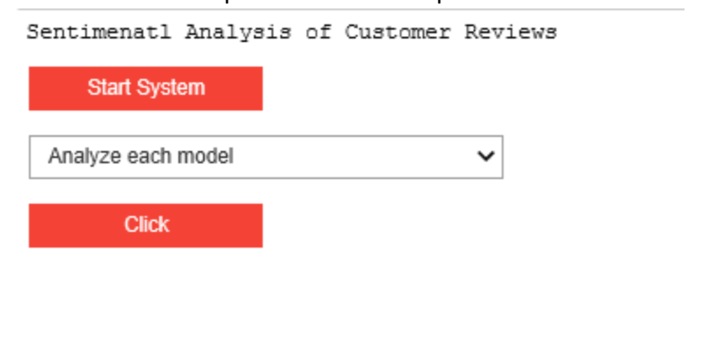
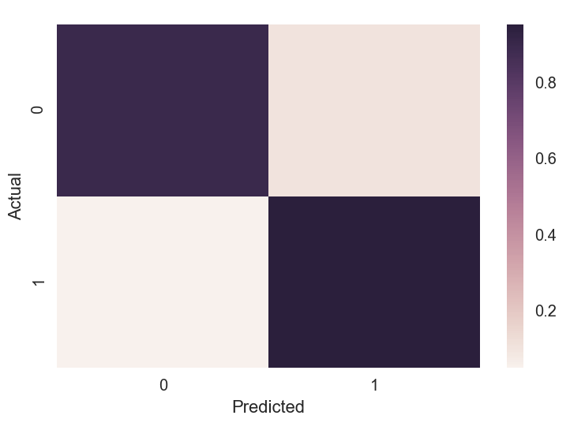
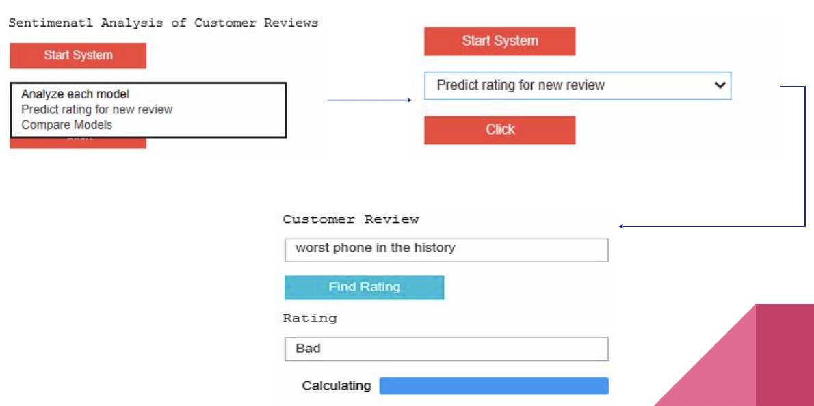
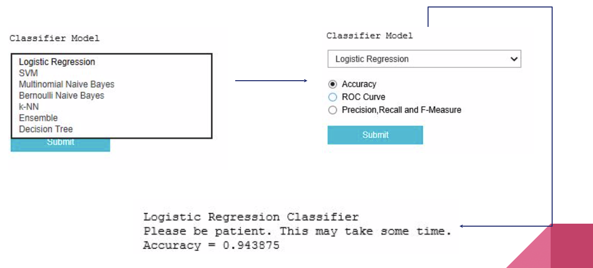

# Product reviews and sentiment analysis

- The project uses opinion mining to analyse customer reviews about mobile phones sold on Amazon.com. 
- The objective is to develop a prediction system that can be used to classify an input customer review of a mobile phone as a good review or a bad one.
- The prediction system uses Ensemble Classifier to classify the input reviews. 
- Compared other classification models such as SVM, Logistic Regression, Multinomial Naïve Bayes, Bernoulli NB, Decision Tree and k-NN but found out that Ensemble Classifier had the best accuracy. 
- The dataset used consists of more than 400,000 reviews from amazon’s unlocked mobile phone category and is available at www.kaggle.com.

# Dependencies

1. Requires python 3.6 or higher.
2. Requires Anaconda and Jupyter Notebook.

# Code files

1. CountVector_Step_By_Step_Implementation.ipynb: This file demonstrates step by step implementation of the various steps involved in implementing the project. The text transformation uses Count Vectorization Technique.

2. TFIDF_Step_By_Step_Implementation.ipynb: This file demonstrates step by step implementation of the various steps involved in implementing the project. The text transformation uses TFIDF Technique.

3. Sentimental_Analysis_OfCustomerReviews_System_Using_Count_Vectorization_Technique.ipynb: This file consists of the code to run the application and uses Count Vectorization Technique for text transformation. The application consists of GUI for easy usability and allow users to predict the rating of new review, analyze and compare different classification models based on their accuracy, precision, recall and f-measure.

4. Sentimental_Analysis_OfCustomerReviews_System_Using_TFIDF_Technique.ipynb: This file consists of the code to run the application and uses TFIDF Technique for text transformation. The application consists of GUI for easy usability and allow users to predict the rating of new review, analyze and compare different classification models based on their accuracy, precision, recall and f-measure.

# Steps to run the code

- Download Anaconda 5.0.0 for Windows or Mac OS from the link: https://www.anaconda.com/download/. 
- Install and run the downloaded version of Anaconda on the computer.
- ‘Jupyter Notebook’ has been installed. To run the ‘Jupyter Notebook’ execute the below command in the Anaconda prompt:

jupyter notebook

- Before running the code files, upload the dataset file, "Amazon_Unlocked_Mobile.csv" in the ‘Jupyter Notebook’.
- To run the file, search the uploaded file in the list of files under the ‘Files’ tab on the home screen. The file will open in new tab of the browser. Then click on the ‘Run Cell’ button to run the code (shown below) Please Note: Execution might take a few minutes.
- Go to the bottom of the code to view the output of the code. At first click on START SYSTEM, and then select an option from the drop box.
- Three options are available in the drop-down box:

1. Analyze each model: Displays ROC curve, Accuracy and

2. Predict rating for New Review: Predicts the rating of the new customer review provided in the text box.

3. Compare Models: Displays a plot comparing accuracy of all the models.
 Precision, Recall and F-Measure for each model. The model for analysis can be chosen further from the
 new dropdown box.
 
 
 
 

